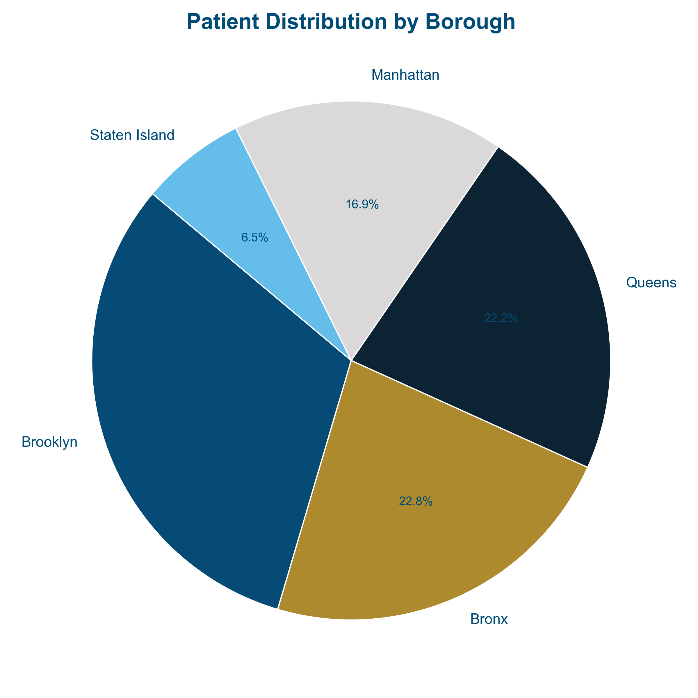
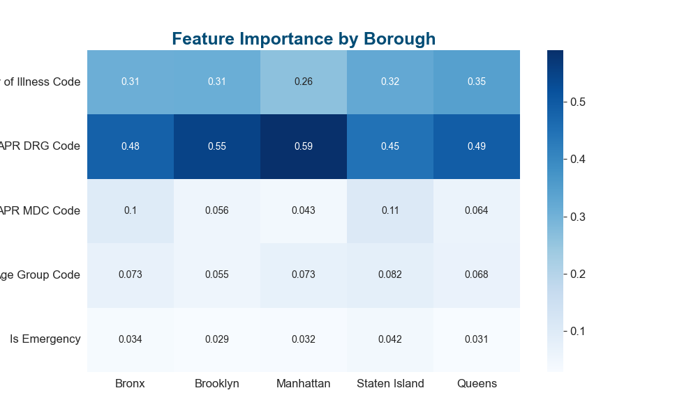
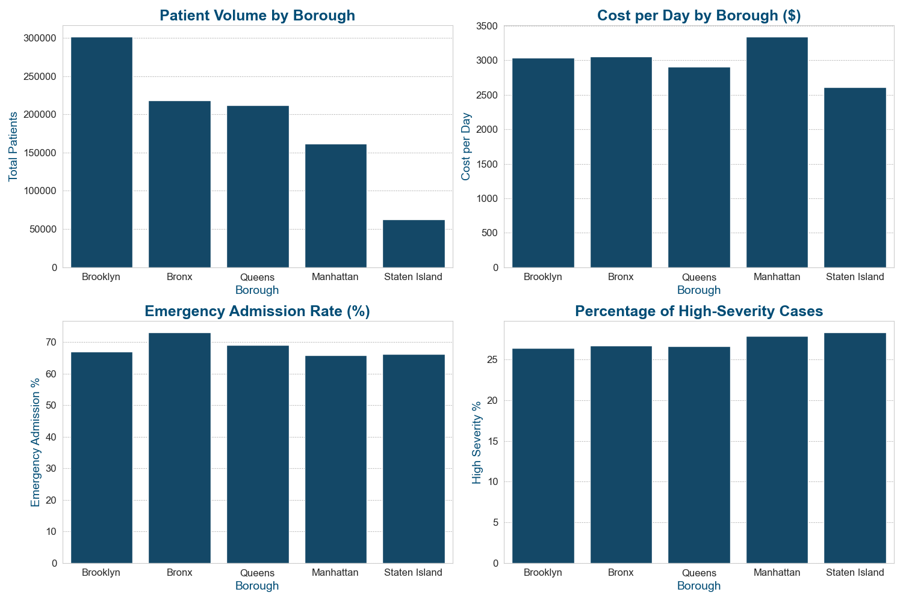

# Decoding Healthcare Costs: NYC Hospital Trends

Analysis of 2016 inpatient discharge data across NYC's five boroughs to uncover cost drivers, operational inefficiencies, and demographic disparities in hospital care.

**Dataset:** [NY SPARCS 2016 — NYS Department of Health](https://health.data.ny.gov/Health/Hospital-Inpatient-Discharges-SPARCS-De-Identified/gnzp-ekau/about_data) | 2.3M records, 34 features

---

## Key Findings

- **Illness severity** is the strongest predictor of both cost and length of stay across all five boroughs
- **Sepsis** is the most expensive diagnosis; **childbirth** is the highest-volume but lowest-cost
- **Brooklyn** is the most cost-efficient borough and serves as an operational benchmark
- **Staten Island** and the **Bronx** have the highest emergency admission rates (67.8% and 66.3%), yet the highest long-stay costs — pointing to capacity gaps
- **APR DRG codes 001–100** (acute care / organ transplants) carry disproportionately high costs; standardizing drug formularies could reduce spend

## Key Visualizations





---

## Project Structure

```
├── data/
│   └── nyhospital.csv          # Source data (not tracked — see Data section below)
├── figures/                    # Output plots generated by the notebook
├── src/
│   ├── data_preprocessing.py   # Loading, cleaning, and feature engineering
│   ├── borough_analysis.py     # Borough-level EDA and visualizations
│   ├── modeling.py             # Random Forest models for cost, LOS, and mortality
│   └── plot_utils.py           # Shared style config
├── NYC_Hospital_Analysis.ipynb # Main analysis notebook
├── requirements.txt
└── README.md
```

---

## Notebook Overview

The analysis notebook follows a question-driven structure mirroring the project presentation:

| Section | Questions Explored |
|---|---|
| Data Loading & Cleaning | Borough assignment, feature engineering, NA handling |
| Patient Demographics | Distribution by borough, age, race/ethnicity |
| Length of Stay | LOS distribution, age vs. LOS, severity vs. LOS |
| Costs & Financial Trends | Cost drivers, diagnosis costs, drug code correlations |
| Admissions & Operations | Payment types, emergency admission rates, borough comparisons |
| Clinical Outcomes | Severity distribution, mortality rates by borough and race |
| Predictive Modeling | Feature importance for cost, LOS, and mortality risk |

---

## Modeling

Three Random Forest models are trained and evaluated per borough:

| Model | Type | Target | Top Features |
|---|---|---|---|
| Cost | Regressor | Total costs | APR DRG Code, Severity |
| LOS | Regressor | Length of stay | Total Costs, APR MDC Code |
| Mortality | Classifier | Extreme mortality risk | Severity, Total Costs |

---

## Setup

**1. Clone the repo**
```bash
git clone https://github.com/<your-username>/<repo-name>.git
cd <repo-name>
```

**2. Create and activate a virtual environment**
```bash
python -m venv venv
source venv/bin/activate       # Windows: venv\Scripts\activate
```

**3. Install dependencies**
```bash
pip install -r requirements.txt
```

**4. Add the data file**

Download the [NY SPARCS 2016 dataset](https://health.data.ny.gov/Health/Hospital-Inpatient-Discharges-SPARCS-De-Identified/gnzp-ekau/about_data) and place it at:
```
data/nyhospital.csv
```

**5. Run the notebook**
```bash
jupyter notebook NYC_Hospital_Analysis.ipynb
```

---

## Tech Stack

`Python` `pandas` `NumPy` `scikit-learn` `Matplotlib` `Seaborn` `Jupyter`
